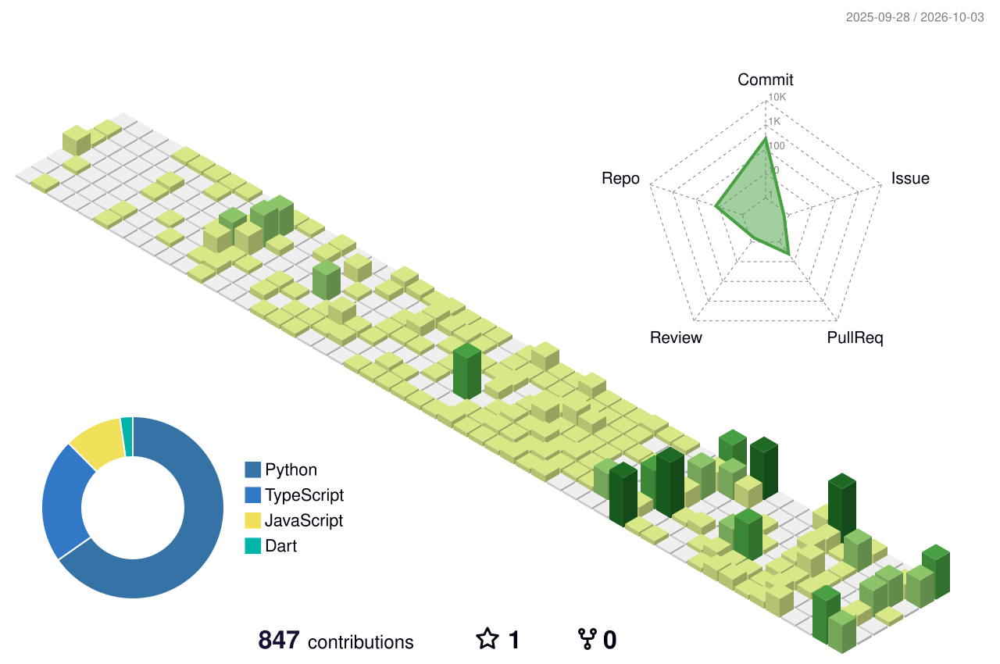

# ⚡ Akram Salah (`5krm`) ⚡

  
  
  

---

## 📊 3D Contribution Calendar

  <!-- Generated automatically by yoshi389111/github-profile-3d-contrib -->
  <picture>
    <source media="(prefers-color-scheme: dark)" srcset="./profile-3d-contrib/profile-green-animate.svg">
    <source media="(prefers-color-scheme: light)" srcset="./profile-3d-contrib/profile-green-animate.svg">
    
  </picture>

 

---

## 📈 GitHub Metrics & Activity

  <!-- Generated automatically by lowlighter/metrics workflow -->
  

 

---

## 💻 Tech Stack & Languages

### Core Technologies

  
  
  
  
  
  
  
  
  

 

<table>
  <tr>
    <td width="50%">
      
    </td>
    <td width="50%">
      
    </td>
  </tr>
  <tr>
    <td colspan="2">
      
    </td>
  </tr>
</table>

 

---

## 🏆 GitHub Achievements

| Quickdraw | Pull Shark | YOLO | Pair Extraordinaire | Galaxy Brain | Starstruck |
| :---: | :---: | :---: | :---: | :---: | :---: |
|  |  |  |  |  |  |
| **⚡ Fast Mover** | **🦈 PR Hunter** | **😎 Zero Review** | **👯 Co-Author** | **🧠 Discussions** | **⭐ Star Power** |

 

---

  ⚡ Generated and maintained with GitHub Actions & Antigravity Automation

